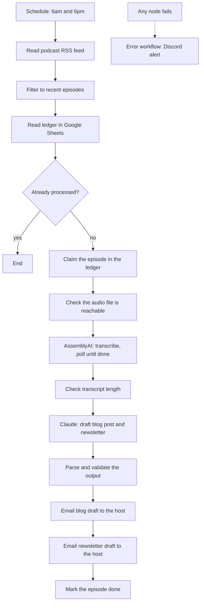

# Podcast to blog and newsletter (n8n)

A scheduled n8n workflow that turns each new podcast episode into a blog draft and a newsletter draft, and emails both to the host to edit.

Built for FiveCardGuys, a sports card and TCG podcast with a large back catalogue and no way to turn episodes into written content. Shared with the client's permission.

**Status:** live in the client's n8n since July 2026. 16 episodes processed as of September 2026.

This repo is a showcase copy. Credentials, IDs, email addresses and the feed URL are replaced with placeholders, and the client's voice and style guide is taken out of the Claude prompt, so it won't run as is.

## What it does

## Reliability decisions

- One ledger row per episode — nothing is processed twice, and a run that dies halfway can be picked up
- Checks before paid calls — the audio link and the transcript length are checked before anything is sent to Claude
- Fail-closed validation — if Claude's output doesn't parse, the run stops, nothing half-finished is emailed
- Retries — set on 11 external calls
- Retry cap — after 3 failed attempts an episode is parked as `failed-permanent` and flagged once, so it can't loop forever
- Separate error workflow — every failure posts to Discord with the node that failed

## Things that went wrong

- The client's host blocked the WordPress API. The WordPress node is still in the workflow, switched off. The workaround emails a paste-ready blog draft instead.
- Two production failures in the first week (a parser that broke on HTML output, and a node setting that n8n reset). Both fixed, and the parser was rewritten to fail closed.

## Services

RSS, AssemblyAI, Anthropic Claude (API), Google Sheets, Gmail, Discord. WordPress was built, then switched off.

## My role

I ran discovery, set the requirements and made the design decisions. Claude wrote most of the code inside the Code nodes. I built parts by hand (the transcription polling loop, credentials, the error workflow, the workaround nodes), and configured, tested and debugged all of it in the client's n8n.

## Files

- `workflows/podcast-pipeline.json` — the main workflow, 28 nodes
- `workflows/error-handler-discord.json` — the error workflow

## To run it yourself

1. Import both files into n8n.
2. Add your own credentials (Google Sheets, Gmail, AssemblyAI, Anthropic).
3. Write your own voice and style guide into the `Build Claude prompt` node.
4. Replace the placeholders: `YOUR_SHEET_ID`, `host@example.com`, the RSS feed URL, the Discord webhook.
5. Set the error workflow on the main workflow's settings.
